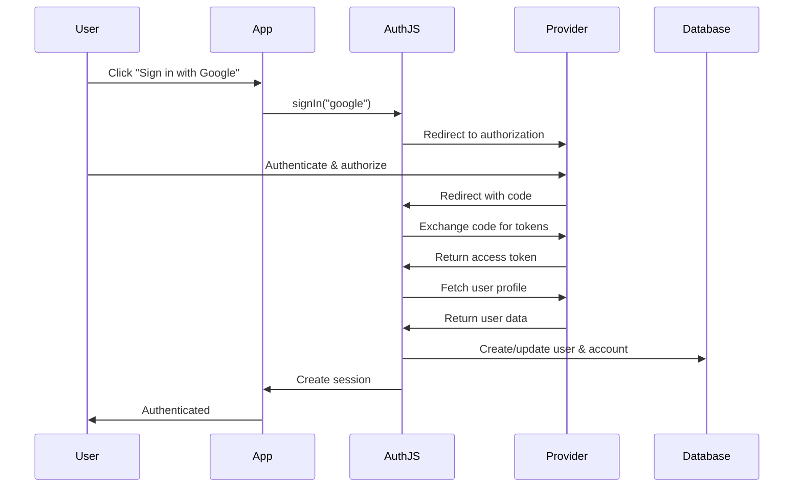

# Auth.js Architecture

## Overview

Auth.js (formerly NextAuth.js) is a complete authentication solution for modern web applications, built as a monorepo containing multiple packages that work together to provide flexible, framework-agnostic authentication.

## Architecture Principles

1. **Framework Agnostic Core**: The `@auth/core` package provides framework-independent authentication logic
2. **Framework Adapters**: Framework-specific packages wrap the core for Next.js, SvelteKit, etc.
3. **Database Adapters**: Modular adapters support various databases and ORMs
4. **Provider System**: Pluggable authentication providers (OAuth, Email, Credentials, WebAuthn)
5. **Security First**: Built-in CSRF protection, secure cookies, encrypted JWTs

## Monorepo Structure

```
next-auth/
├── packages/
│   ├── core/                    # Framework-agnostic core logic
│   ├── next-auth/               # Next.js integration
│   ├── frameworks-sveltekit/    # SvelteKit integration
│   ├── frameworks-express/      # Express.js integration
│   ├── frameworks-qwik/         # Qwik integration
│   ├── frameworks-solid-start/  # Solid Start integration
│   ├── adapter-*/               # Database adapters
│   └── utils/                   # Shared utilities
├── apps/
│   ├── dev/                     # Development applications
│   └── examples/                # Example implementations
└── docs/                        # Documentation site
```

## Core Components

### 1. @auth/core

The heart of Auth.js, containing:

- **Authentication Flow**: Sign in, sign out, session management
- **Provider System**: OAuth, OIDC, Email, Credentials, WebAuthn providers
- **JWT Handling**: Token generation, encryption, validation
- **Security**: CSRF protection, cookie management, secure defaults
- **Events & Callbacks**: Extensibility hooks for custom logic

**Key Files:**

```
packages/core/src/
├── index.ts              # Main Auth() function
├── errors.ts             # Error definitions
├── jwt.ts                # JWT encoding/decoding
├── adapters.ts           # Adapter interface
├── types.ts              # TypeScript definitions
├── providers/            # Provider implementations
│   ├── oauth.ts          # OAuth base provider
│   ├── credentials.ts    # Username/password provider
│   └── [provider].ts     # Individual providers
└── lib/
    ├── actions/          # Authentication actions
    ├── utils/            # Utility functions
    └── pages/            # Built-in UI pages
```

### 2. Framework Integrations

Each framework package wraps `@auth/core` with framework-specific code:

**next-auth (Next.js):**

- Server Actions integration
- API Routes compatibility
- Middleware support
- App Router & Pages Router support

**@auth/sveltekit:**

- SvelteKit hooks integration
- Server-side authentication
- Form actions
- Load functions

**@auth/express:**

- Express middleware
- Request/Response handling
- Session management

### 3. Database Adapters

Adapters follow a common interface defined in `@auth/core/adapters`:

```typescript
interface Adapter {
  createUser(user: Omit<AdapterUser, "id">): Promise<AdapterUser>
  getUser(id: string): Promise<AdapterUser | null>
  getUserByEmail(email: string): Promise<AdapterUser | null>
  getUserByAccount(params): Promise<AdapterUser | null>
  updateUser(user: Partial<AdapterUser>): Promise<AdapterUser>
  deleteUser(userId: string): Promise<void>
  linkAccount(account: AdapterAccount): Promise<void>
  unlinkAccount(params): Promise<void>
  createSession(session: AdapterSession): Promise<AdapterSession>
  getSessionAndUser(sessionToken: string): Promise<{...} | null>
  updateSession(params): Promise<AdapterSession | null>
  deleteSession(sessionToken: string): Promise<void>
  createVerificationToken(params): Promise<VerificationToken>
  useVerificationToken(params): Promise<VerificationToken | null>
  // Optional methods for WebAuthn
  createAuthenticator?(params): Promise<AdapterAuthenticator>
  getAuthenticator?(credentialID: string): Promise<AdapterAuthenticator | null>
  listAuthenticatorsByUserId?(userId: string): Promise<AdapterAuthenticator[]>
  updateAuthenticatorCounter?(params): Promise<AdapterAuthenticator>
}
```

**Supported Adapters:**

- Prisma, Drizzle, Kysely (SQL ORMs)
- MongoDB, Firebase, Fauna (NoSQL)
- DynamoDB, Supabase, Xata (Cloud databases)
- Redis (Upstash), Unstorage (Universal storage)

## Authentication Flow

### OAuth Flow



### Session Management

**JWT Strategy (Default):**

- Stateless sessions
- No database required
- Encrypted tokens
- Self-contained user data

**Database Strategy:**

- Sessions stored in database
- More control over session lifecycle
- Can revoke sessions server-side
- Requires adapter

## Configuration System

Auth.js uses a declarative configuration:

```typescript
export const { handlers, auth, signIn, signOut } = NextAuth({
  // Providers
  providers: [
    Google({ clientId, clientSecret }),
    GitHub({ clientId, clientSecret }),
  ],

  // Database adapter (optional)
  adapter: PrismaAdapter(prisma),

  // Session strategy
  session: {
    strategy: "jwt", // or "database"
    maxAge: 30 * 24 * 60 * 60, // 30 days
  },

  // Callbacks for customization
  callbacks: {
    async signIn({ user, account, profile }) {
      /* ... */
    },
    async session({ session, token, user }) {
      /* ... */
    },
    async jwt({ token, user, account }) {
      /* ... */
    },
  },

  // Events for side effects
  events: {
    async signIn({ user }) {
      /* Log sign in */
    },
    async signOut({ token }) {
      /* Clean up */
    },
  },

  // Pages customization
  pages: {
    signIn: "/auth/signin",
    error: "/auth/error",
  },
})
```

## Security Model

### CSRF Protection

- Every mutation includes CSRF token
- Tokens validated on server
- Prevents cross-site request forgery

### Cookie Security

```typescript
{
  name: "__Secure-authjs.session-token",
  options: {
    httpOnly: true,
    sameSite: "lax",
    path: "/",
    secure: true, // in production
  }
}
```

### JWT Encryption

- Default: A256CBC-HS512 (JWE)
- Keys derived from secret using HKDF
- Tokens signed and encrypted
- Short expiration times

### Host Validation

- Trusted host must be configured
- Prevents host header attacks
- Required in production

## Build System

### Turborepo

Used for:

- Parallel builds
- Intelligent caching
- Dependency graph management
- Remote caching (optional)

### TypeScript

- Strict mode enabled
- Type checking before build
- `.d.ts` generation for all packages
- Source maps for debugging

### Testing

- **Vitest**: Unit and integration tests
- **Playwright**: E2E tests
- **Coverage**: Tracked with Vitest coverage

## Development Workflow

1. **Local Development**: Run dev apps in `apps/dev/`
2. **Testing**: Unit tests run on changed packages only
3. **Building**: Turbo builds dependent packages first
4. **Linting**: ESLint + Prettier enforce code style
5. **Git Hooks**: Lefthook runs format/lint pre-commit
6. **CI/CD**: GitHub Actions for testing and releases

## Deployment Considerations

### Edge Runtime Support

- Compatible with Vercel Edge
- Cloudflare Workers support
- No Node.js APIs in core

### Bundle Size

- Tree-shakeable exports
- Provider imports on-demand
- Minimal runtime overhead

### Performance

- Stateless JWT sessions (no DB roundtrip)
- Efficient cookie handling
- Lazy loading of providers

## Extension Points

### Custom Providers

```typescript
import type { OAuthConfig } from "@auth/core/providers"

export default function MyProvider(config): OAuthConfig {
  return {
    id: "myprovider",
    name: "My Provider",
    type: "oauth",
    authorization: { url, params },
    token: { url, params },
    userinfo: { url, params },
    profile(profile) {
      return { id, name, email, image }
    },
    ...config,
  }
}
```

### Custom Adapters

Implement the `Adapter` interface for your database.

### Custom Pages

Override default UI pages with your own components.

### Callbacks

Extend behavior at key points in the auth flow.

## Future Considerations

- **Multi-tenancy**: Better support for multi-tenant apps
- **Enhanced WebAuthn**: Improved passkey support
- **Performance**: Further optimization for edge runtimes
- **DX**: Better TypeScript inference
- **Testing**: More comprehensive E2E coverage

## Resources

- [Official Documentation](https://authjs.dev)
- [GitHub Repository](https://github.com/nextauthjs/next-auth)
- [Community Discussions](https://github.com/nextauthjs/next-auth/discussions)
- [Security Policy](../SECURITY.md)

---

**Last Updated**: October 2025
**Version**: 5.x (v5 architecture)
